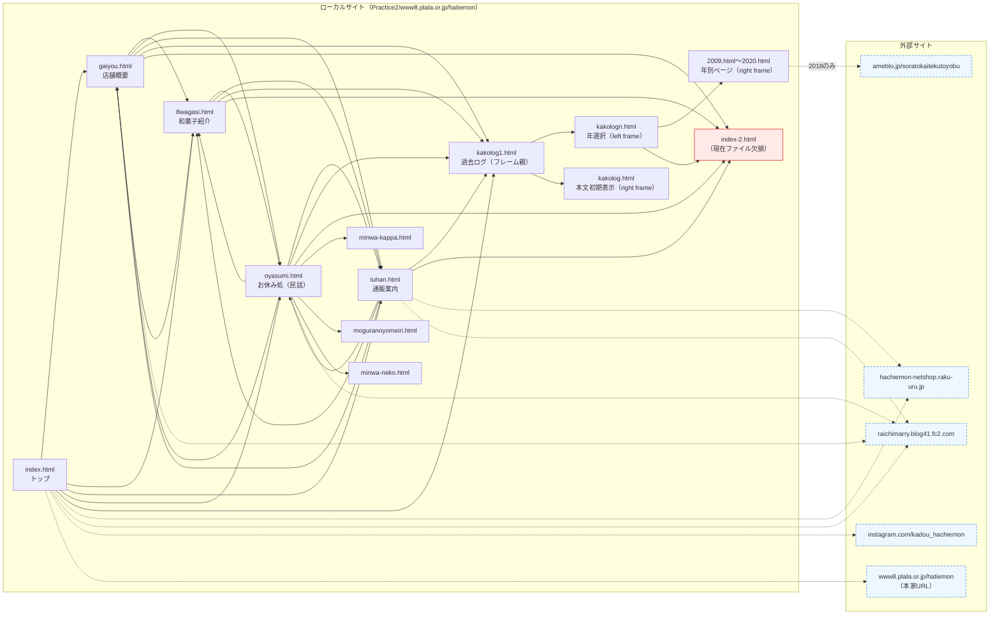

# Practice2 保守レポート

## 1. 対象と概要

- 対象ディレクトリ: `Practice2`
- 構成:
  - HTML: 26ファイル
  - CSS: 3ファイル
  - JavaScript: 1ファイル
- エントリーポイント:
  - `Practice2/index.html`（`www8.plala.or.jp/hatiemon/index.html` へのリダイレクト）

## 2. サイト構造（主要導線）

- トップ:
  - `Practice2/www8.plala.or.jp/hatiemon/index.html`
- 主要ページ:
  - 店舗概要: `Practice2/www8.plala.or.jp/hatiemon/gaiyou.html`
  - 和菓子紹介: `Practice2/www8.plala.or.jp/hatiemon/8wagasi.html`
  - 通販案内: `Practice2/www8.plala.or.jp/hatiemon/tuhan.html`
  - お休み処（民話）: `Practice2/www8.plala.or.jp/hatiemon/oyasumi.html`
- 過去ログ:
  - フレーム親: `Practice2/www8.plala.or.jp/hatiemon/kakolog1.html`
  - 年選択メニュー: `Practice2/www8.plala.or.jp/hatiemon/kakologn.html`
  - 本文: `Practice2/www8.plala.or.jp/hatiemon/kakolog.html`
  - 年別ページ: `2009.html`〜`2020.html`

### 2.1 画面遷移図（Mermaid）

### 2.2 外部サイト遷移の補足

- `index.html` → `http://raichimarry.blog41.fc2.com/`
- `index.html` → `https://www.instagram.com/kadou_hachiemon/`
- `gaiyou.html` → `http://raichimarry.blog41.fc2.com/`
- `oyasumi.html` → `http://raichimarry.blog41.fc2.com/`
- `tuhan.html` → `http://raichimarry.blog41.fc2.com/`
- `2018.html`（年別ページ）→ `https://ameblo.jp/soratokaitekutoyobu/`

## 3. 今回実施した保守性改善

- HTML/CSS/JS 全体をインデント・改行ルールで整形（機能/デザインは維持）。
- JSの命名を読みやすく整理:
  - 対象: `Practice2/www8.plala.or.jp/hatiemon/hpbmapscript3.js`
  - `map`, `point`, `event`, `info`, `open` のような曖昧名を明確化。
  - 既存参照互換のため、旧グローバル名（`lat`, `lng`, `markerwindowinfo` 等）はエイリアスとして維持。

## 4. 問題点（現状）

### 高優先

- 文字コード混在/文字化けの疑い
  - `UTF-8` と `Shift_JIS` 宣言が混在し、表示文面に崩れた文字列が見られるページがある。

### 中優先

- アクセシビリティ不足
  - `alt` 未設定画像: 256件
- メタ情報不足
  - 空の `<title>`: 24ファイル
- 古いHTML記法が多数
  - `font`/`align`/`border` 属性、`frame`系タグ等: 661箇所
  - 影響: 意図把握しづらい、将来の改修コスト増

### 低優先

- `<!DOCTYPE>` 未定義ページ: 3ファイル
  - `Practice2/www8.plala.or.jp/hatiemon/index.html`
  - `Practice2/www8.plala.or.jp/hatiemon/index-2.html`
  - `Practice2/www8.plala.or.jp/hatiemon/pc_arrow1.html`
- `Content-Type` メタの重複: 2ファイル
  - `Practice2/www8.plala.or.jp/hatiemon/index.html`
  - `Practice2/www8.plala.or.jp/hatiemon/index-2.html`
- `http://` 外部リンクが複数（13件）
  - HTTPS化可能な先は切り替え検討余地あり

## 5. 次の保守方針（推奨）

- 段階1: 参照切れ修正（画像/リンク）と文字コード統一（UTF-8へ寄せる）
- 段階2: `title` と `alt` の整備
- 段階3: フレーム/旧属性の段階的置換（CSSクラスへ移行）
- 段階4: 共通ヘッダ・ナビ・フッタのテンプレート化
